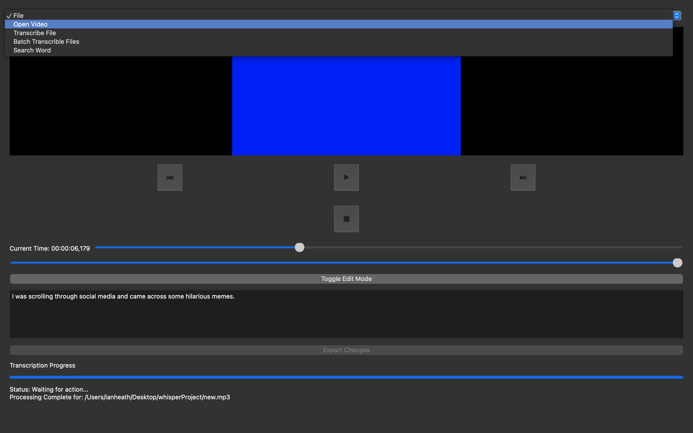

# CaptionForge

CaptionForge is a desktop application that streamlines subtitle generation and editing for video and audio content. Leveraging PyQt5, ffmpeg, and whisper, it offers an intuitive interface for efficient media transcription and subtitle customization.

### :computer: Technologies

 - **Python**: The core programming language used for developing the application logic.
 - **PyQt5**: A set of python bindings for Qt application framework, used for creating the graphical user interface. 
 - **FFmpeg**: A multimedia framework for processing audio and video files, used for file conversions and handling media content within the application. 
 - **Whisper**: OpenAI's automatic speech recognition system, utitilized for transcribing audio to text, forming the backbone of the subtitle generation process. 

 ### :pencil: Features

- **Video Playback**: Integrated video player with customizable playback controls, allowing users to view their media content directly within the application.
- **Automatic Transcription**: Utilizes whisper to automatically transcribe audio from video and audio files into subtitles, significantly reducing manual transcription work.
- **Subtitle Editing**: Dedicated text editing interface for manually refining generated subtitles, ensuring accuracy and synchronization with the media.
- **Batch Processing**: Supports processing multiple files simultaneously, enabling efficient management of large projects or collections of media files.
- **Export Functionality**: Allows users to export edited subtitles back into their video, making the final content ready for distribution and viewing.
- **Search Functionality**: Users can search within subtitles for specific words or phrases, facilitating easy navigation and editing.

 ### :seedling: The process

Under the guidance of my mentor at Texas State University, I was tasked with creating an accessible program that leverages OpenAI's Whisper for easy video transcription, eliminating the need for command line operations. 

This led to the development of a user-friendly GUI application designed for seamless transcription and subtitle editing. After months of development and incorporating numerous functionalities for enhanced ease of access, we successfully created a comprehensive solution for subtitle management. 

Aimed at facilitating educational engagement, this application, now set to be adopted by Texas State, is especially tailored for assisting children with disabilities by generating subtitles for videos with simplicity and efficiency.

 ### :brain: What I learned

- **Environment Management**: I mastered the creation and management of isolated environments using Conda, streamlining dependency management and distribution across different systems.

- **Programming Skills**: Coming from a background in C++ and JavaScript, I learned Python from scratch, expanding my programming language knowledge and deepening my coding proficiency.

- **GUI Development**: I acquired skills in designing graphical user interfaces (GUIs), learning about the essential components and considerations involved in setting them up.

- **Library Integration**: I learned to utilize powerful libraries like PyQt5, Whisper, and FFmpeg, integrating them into my project to augment its functionality.

- **Command Line Proficiency**: My project enhanced my command line skills, enabling me to efficiently navigate, run, and build upon my development work.

- **MarkDown Mastery**: As I type this, I have also learned a new widely used markup language. This skill has allowed me to create more structured and visually appealing text documents for my GitHub repository, enhancing documentation and project presentation.

- **GitHub Skills**: I've also developed my abilities in using GitHub, learning how to upload repositories to showcase and share my projects. 
captionForge.pngkcaptionForge.pngk
### The Project

